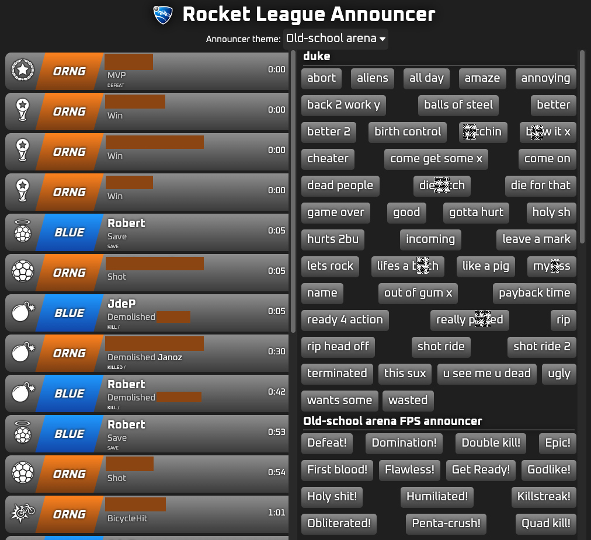
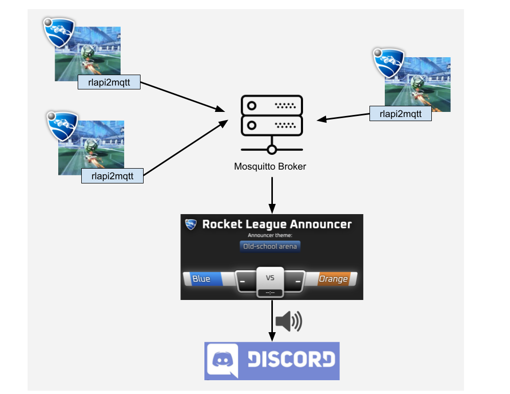

# RocketLeague Announcer

### Your favourite Rocket League companion

RocketLeague Announcer is a real-time soundboard and announcer that responds to in-game events. It subscribes to game data via MQTT and plays relevant sound samples through a Discord voice channel, creating an immersive "unreal tournament" style experience for your matches.

## Features

 - **Real-time Announcements**: Immediate response to goals, saves, and demolitions.
 - **Discord Integration**: Joins a voice channel to broadcast announcements to your team.
 - **MQTT Powered**: Subscribes to lightweight MQTT messages from [rlapi2mqtt](https://github.com/robertalpha/rlapi2mqtt).
 - **Intelligent Logic**: Complex event detection for demolition chains and mutual destructions.
 - **Extensible Sound Packs**: Fully customizable sound mappings and priorities.
 - **Web Interface**: Real-time scoreboard and manual soundboard for the "very optional" hype.

## How It Works

### MQTT & Deduplication
The application listens for `StatMessage` and `GameEventMessage` topics on an MQTT broker. Because multiple events can sometimes fire simultaneously or in very rapid succession, the announcer uses a **DeJitter** mechanism:
- **100ms Window**: Events occurring within the same 100ms window are grouped together.
- **Priority-based Selection**: If multiple announcements trigger at once (e.g., a "Goal" that is also a "Long Goal"), the system uses the `weight` defined in your sound pack mapping to pick the most significant one.
- **Deduplication**: This ensures that your Discord channel isn't flooded with overlapping audio for the same in-game action.

### Announcement Logic Examples
- **DemoChain**: Tracks player demolitions. If you get multiple demos within an 11-second window, it announces "Double Kill", "Triple Kill", up to "Penta Kill".
- **FirstBlood**: Specifically triggers for the very first demolition of the match.
- **MutualDestruction**: Triggers when two players demolish each other within a 500ms window.
- **AsIs**: Direct 1-to-1 mappings for standard events like Saves, Epic Saves, Hattricks, and various goal types (Aerial, Bicycle, Turtle, etc.).
- ... and many more to be found in the [announcement logic package](src/main/kotlin/services/announcement).

## Customizability & Sound Packs

The announcer is designed around **Sound Packs**. A sound pack consists of a ZIP file containing audio samples and a `mapping.json` file that defines how events map to those samples.

### Mapping JSON
You can define custom weights and multiple sample variations for each announcement:

```json
{
  "name": "FPS Pack",
  "info": "Classic FPS style announcements",
  "mapping": [
    {
      "announcement": "FIRST_BLOOD",
      "weight": 100,
      "samples": ["first_blood_1.mp3", "first_blood_alt.wav"]
    },
    {
      "announcement": "DEMOLITION",
      "weight": 50,
      "samples": ["explosion.mp3"]
    },
    {
      "announcement": "GOAL",
      "weight": 10,
      "samples": ["goal.mp3"]
    }
  ]
}
```

- **Weight**: Determines priority during the 100ms de-jitter window (higher weight wins). Example: A FirstBlood announcement is always coupled with a Demolition, so to prioritize FirstBlood the weight needs to be higher than the one for the Demolition.
- **Samples**: If multiple samples are provided, one is selected at random for variety.

## Testing

The project maintains a strong focus on reliability, particularly for the core announcement logic and message handling.

### Test Categories
- **Unit Tests**: Extensive coverage for individual announcement logic (e.g., `DemolitionChain`, `MutualDestruction`, `FirstBlood`). These tests verify complex time-based and state-based rules.
- **Integration Tests**: End-to-end tests that simulate the full message flow from MQTT broker to the `AnnouncementHandler`.
- **Infrastructure Tests**: Verify the Ktor server configuration and SSE event streams.

### Tools Used
- **Kotest**: Used for expressive assertions and test runners.
- **Testcontainers**: Used in integration tests to spin up a real MQTT broker (Mosquitto) to verify the messaging client's behavior in a realistic environment.

To run the tests, use:
```bash
./gradlew test
```

## Screenshot



## Diagram



## Building & Running

To build or run the project, use one of the following tasks:

| Task                          | Description                                                          |
| -------------------------------|---------------------------------------------------------------------- |
| `./gradlew test`              | Run the tests                                                        |
| `./gradlew build`             | Build everything                                                     |
| `buildFatJar`                 | Build an executable JAR of the server with all dependencies included |
| `buildImage`                  | Build the docker image to use with the fat JAR                       |
| `publishImageToLocalRegistry` | Publish the docker image locally                                     |
| `run`                         | Run the server                                                       |
| `runDocker`                   | Run using the local docker image                                     |

### Quick Start with Docker
The quickest way to start is through Docker. The default image also starts a local Mosquitto Broker:

```bash
docker run  --env-file rocketleague-announcer.env -p 8080:8080 -p 1883:1883 ghcr.io/robertalpha/rocketleague-announcer:main
```

You'll need an env file `rocketleague-announcer.env` with valid credentials:
- **DISCORD_BOT_TOKEN**: [Follow this guide to create a bot](https://jda.wiki/using-jda/getting-started/#creating-a-discord-bot).
- **DISCORD_VOICE_CHANNEL_ID**: The ID of the voice channel where the bot should join.
- **BROKER_ADDRESS** (Optional): Defaults to `tcp://localhost:1883` which will connect to the broker included in the container.

See [example.env](docs/example.env) for a template.

### Disclaimer:
The Rocket League name and logo are a registered trademark of Psyonix and Epic Games. Its use in this project does not imply endorsement, sponsorship, or affiliation with Rocket League Announcer.
